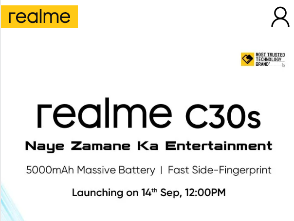
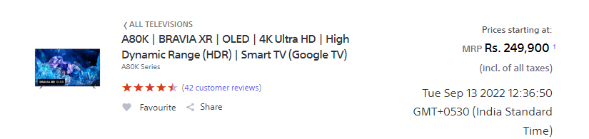

# Dom Manipulation Assignment

1. Webiste Name: [Dev To](https://dev.to/)

### Topics

    - Query Selctory, Inner HTML

### Sample Image

### Tasks

        Target the Top description div and change the DEV Community to <Your_Name> and description to your passion

### Output

//Answer 
document.querySelector(".crayons-subtitle-2")
<h2 class=​"crayons-subtitle-2 lh-tight mb-4">​ DEV Community 👩&zwj;💻👨&zwj;💻 is a community of 993,399 amazing developers ​</h2>​
document.querySelector(".crayons-subtitle-2").innerText="Ineuron";
'Ineuron'
document.querySelector(".color-base-70");

​…​
‚Äã
document.querySelector(".color-base-70").innerText="i write code.";
'i write code.'

2. Website Name: [Apple](https://support.apple.com/en-in)

### Task

### Fetch all the product name and store in an array

### Output

['iPhone', 'Mac', 'iPad', 'Watch', 'AirPods', 'Music', 'TV']

//ans
var arr=document.querySelectorAll(".as-imagegrid-item");
arr.forEach(function(element){
    var productName=element.querySelector("a").getAttribute("data-analytics-link-component_name");
    productNames.push(productName);})
console.log(productNames);

3. Webiste Name: [Youtube Support](https://support.google.com/youtube/)

### Topics

    - Get Element By Id, Create Element, Create Text Node, Append Child

### Sample Image

### Tasks

     Add another FAQ 'My New FAQ' to the list

### Output

//ans
var originalElement=document.querySelectorAll(".parent")[0];
var newElement=document.createElement("section");
let attributes = originalElement.attributes;
for (let i = 0; i < attributes.length; i++) {
    newElement.setAttribute(attributes[i].name, attributes[i].value);
};
newElement.innerHTML = originalElement.innerHTML;
var insidee=newElement.querySelector("h3");
insidee.innerText="My New FAQ";
var parent=document.querySelector(".accordion-homepage");
parent.appendChild(newElement);

4. Webiste Name: [OnePlus](https://www.oneplus.in/support)

### Topics

     Query Selector, InnerText

### Sample Image

### Tasks

      Change the contact number

### Output

5. Webiste Name: [Samsung](https://www.samsung.com/in/offer/online/samsung-fest/)

### Topics

       getElementById, createElement, InnerText, append, setAttribute

### Sample Image

### Tasks

     Target the main div of card and change the Button text to Check out

### Output

//ANS
var parent=document.querySelectorAll(".listing")[2];
var inside=parent.querySelectorAll(".mytabs")[2];
var insidee=inside.querySelector("div");
insidee.querySelectorAll("a")[1].innerText="checkout";

6. Webiste Name: [Adidas](https://www.adidas.co.in/)

### Topics

    -   Query Selector, Event listeners, Changing Styles

### Sample Image

### Tasks

     Target the search box and on hover change thebackground color to red.

### Output

//ans
document.querySelector("._input_1f3oz_13").addEventListener("mouseover",(event)=>{ event.target.style.backgroundColor="red"});
document.querySelector("._input_1f3oz_13").addEventListener("mouseout",(event)=>{ event.target.style.backgroundColor=""});

7. Webiste Name: [MDN Web Docs](https://developer.mozilla.org/en-US/)

### Topics

       Form, Value, Submit

### Sample Image

document.getElementById("hp-search-input").value="CSS Selectors";
document.getElementById("hp-search-form").submit();

### Tasks

     To Search a topic in the MDN Search bar.
     First add a text to search in the search bar and then hit the submit search button to search the docs using DOM

### Output

8. Webiste Name: [Google](https://www.google.com/)

### Topics

       Remove Elements

### Sample Image

### Tasks

     Remove alternate languages from the home page languages listed

### Output

var items=document.querySelectorAll("a");
for(var i=5;i<14;i++){
    if(i%2==0){
        items[i].remove();
    }};
9. Webiste Name: [Code Wars](https://www.codewars.com/)

### Topics

       Change Font Family, Color of Text.

### Sample Image

### Tasks

    Change the font family of the text to monospace and text color to the logo’s background color.

### Output

//ans
document.querySelector(".text-color-white");
<h1 class=​"text-color-white">​…​</h1>​
var div=document.querySelector(".text-color-white");
undefined
div.style.fontFamily="monospace";
'monospace'
div.style.color="red";
'red'
document.querySelector(".text-color-hero-gradient").style.color="red";
'red'

10. Webiste Name: [Freecodecamp](https://www.freecodecamp.org/)

### Topics

       querySelector, mouseover, click eventListener,  callback function, style,

### Sample Image

### Tasks

    Target the button and change background colour on mouseover

### Output

//ans
var div=document.querySelectorAll(".login-btn-text")[1];
undefined
div.addEventListener("mouseover",(event)=>{ event.target.style.backgroundColor="red"});

11. Webiste Name: [realme](https://www.realme.com/in/)

### Topics

       querySelector,style,background-image

### Sample Image

### Tasks

    change the realme logo to ineuron logo

### Output

//Ans
var item=div.querySelector("span");
item.style.backgroundImage = "url('https://ineuron.ai/images/ineuron-logo.png')";x`

12. Webiste Name: [Github](https://github.com/)

### Topics

       querySelector,style,background-Color

### Sample Image

### Tasks

     change the background colour of the button to blue.

### Output

//ans
var div=document.querySelector(".f4");
var inside=div.querySelector("a");
inside.style.backgroundColor="blue";

13. Webiste Name: [Hackerrank](https://www.hackerrank.com/)

### Topics

       querySelector,innerHtml

### Sample Image

### Tasks

Target the top description and change “Matching developers with great companies” to ‘JSBOOTCAMP“.

### Output

14. Webiste Name: [Asus](https://www.asus.com/in/)

### Topics

      querySelector,style,font-size

### Sample Image

### Tasks

       change the fontsize of “Hot Deals” to 80px

### Output

//ans
var div=document.querySelector(".HotDealsAll__Heading__2fIbe");
div.style.fontSize="80px";

15. Webiste Name: [Dell](https://www.dell.com/en-in/shop/deals/laptop-deals?gacd=10415953-9016-5761040-285981356-0&dgc=ST&gclid=Cj0KCQjwguGYBhDRARIsAHgRm4-XUDMhhVNyHXb3s1gY4ZBzORr_d9Se-buhJwy7asyUe7YdqEA11eEaAt6UEALw_wcB&gclsrc=aw.ds&nclid=BxjBlpBQsX6pjSHh-L8YYSU77EpfXRkG1AGMB5Wbeu386ykspfrPDnfx_DdFau20)

### Topics

      querySelector,style.textAlign

### Sample Image

### Tasks

       Convert the text “G15 Gaming Laptop” from left to right

### Output

//ans
var div=document.querySelectorAll(".ps-title")[4];
div.style.textAlign="right";

16. Webiste Name: [Vercel](https://vercel.com/)

### Topics

     querySelector,innerHTMl

### Sample Image

### Tasks

      change the heading “Start with the developer” to “Start with Scratch”

### Output

//ans
var inside=document.querySelectorAll(".section-title_title__VEDfK")[0];
inside.innerText="Start with Scratch";

17. Webiste Name: [Sony](https://www.sony.co.in/)

### Topics

    querySelector,innerHTMl

### Sample Image

### Tasks

     change the button text To current Date.

### Output

//ans
var div=document.querySelectorAll(".btn-container")[0];
var today = new Date();
div.innerHTML="<h1>Today's date is: " + today.toLocaleDateString() + "</h1>";

18. Webiste Name: [Philips](https://www.philips.co.in/)

### Topics

     querySelector,style,backgroundcolor

### Sample Image

### Tasks

    change the background colour blue to orange

### Output

//ans
var div=document.querySelector(".p-f03-footer-container ");
div.style.background="yellow";

19. Webiste Name: [Canon](https://in.canon/)

### Topics

          querySelector,src

### Sample Image

### Tasks

    extract the canon logo

### Output

//ans
var div=document.querySelector(".logo");
var inside=location.origin + div.getAttribute("src");

20. Webiste Name: [Oppo](https://www.oppo.com/in/)

### Topics

          querySelector,style,color

### Sample Image

### Tasks

      Change the description colour black to orange

### Output

//ANS
var div=document.querySelector(".desc");
div.style.color="orange";
